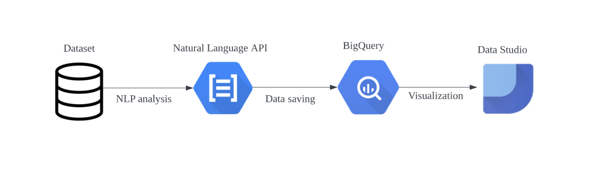

# Demo3 - SentimentAnalyzer

## Background

Reputational due diligence is a process of analyzing the reputation of an entity (either a person or an organization) and identifying any reputational risks associated with the entity. Traditionally, it is performed through a manual review and analysis of documents (e.g. news articles, legal documents and specialized publications) in which the entity of interest is mentioned. Such a manual process is cumbersome and time consuming.

We hereby present a solution, called _SentimentAnalyzer_, that automates the sentiment analysis of news articles. It can accept a collection of news articles and perform the following analysis on each article:
- measure its overall sentiment 
- extract all the noteworthy individuals mentioned in the article
- measure the sentiment of these individuals

The script then uploads the analysis results into a BigQuery table, which is in turn connected to a Data Studio dashboard that visualizes these results. 

## Code

The development of the solution is presented in the notebook file `SentimentAnalyzer.ipynb`.

This notebook contains the following steps:
- The creation of BigQuery table that will store the articles and the analysis results
- The import, description and EDA of the dataset
- The application of the core function `analyze_article` that applies the Natural Language API and performs sentiment analysis on a given article
- The uploading of the analysis results on the BigQuery table

Should you want to run the above steps from scratch, please run the notebook from top to bottom.

The accompanying Data Studio dashboard, which visualizes the analysis results, can be found on the following [link](https://datastudio.google.com/u/0/reporting/9f62a4aa-3b5f-4716-b190-10be9a2b9bb2/page/0weuC). 

